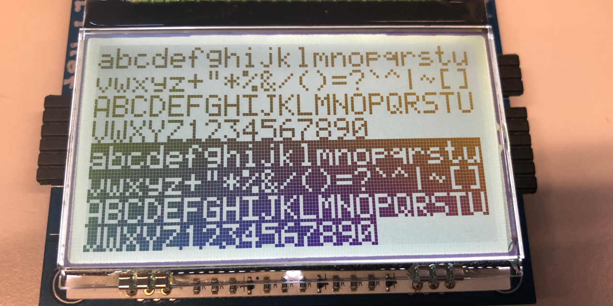

# GUC_dogl128

Copyright (C) 2019, 2020 Guillaume Guillet

## Description
A source library for the dogl128 LCD screen

EA DOGL128-6 GRAPHIC datasheet
https://www.lcd-module.com/eng/pdf/grafik/dogl128-6e.pdf



> Working version : 1.1\
> Actual version : 1.1

## Compatible (tested) microcontroller

Silicon labs :
C8051F38x

## Principal functions

```c
//Initialization of the DogL128
void GUC_dog_init();
   
//Send data to the display through SPI
void GUC_dog_sendByte(const unsigned char _byte, bit _a0);
//Set the cursor position, _page 0 to 7, _row 0 to 127.
void GUC_dog_setCursorPos(const unsigned char _page, const unsigned char _row);
//Clear the screen with a specify value (0x00 for a empty screen).
void GUC_dog_clearScreen(const unsigned char _value);

//Write a ASCII character where the cursor is (_invert can switch the black and white pixel).
void GUC_dog_charWrite(unsigned char _valueChar, const unsigned char _invert);
//Write a Null-terminated ASCII text where the cursor is (_invert can switch the black and white pixel).
void GUC_dog_stringWrite(const unsigned char* _str, const unsigned char _invert);
//Write a Length-prefixed ASCII text where the cursor is (_invert can switch the black and white pixel).
void GUC_dog_pstringWrite(const unsigned char* _str, const unsigned char _invert);
```
